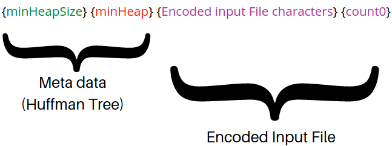
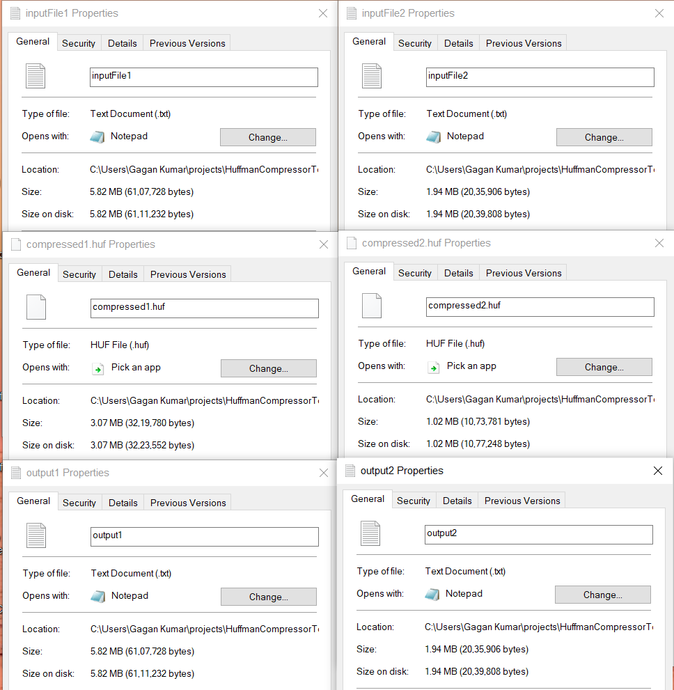

#  File Compression Tool Using C++

## Overview

Welcome to the Huffman Coding File Compression Tool! This tool utilizes Huffman coding, a lossless compression algorithm, to reduce the size of text files. By encoding frequently used characters with shorter codes and less frequent characters with longer codes, we achieve efficient file compression.

## Features

- **Compression of text files using Huffman coding:** Efficiently reduce the size of text files by employing the Huffman coding algorithm.
  
- **Decompression of Huffman-coded files:** Restore the original text from compressed files with ease.

- **Multithreading for Concurrent Compression:** Enhance performance by utilizing multithreading capabilities. This feature allows the tool to compress two files simultaneously, reducing overall compression time and maximizing resource utilization.

## Implementation Details

This project supports two main functions:

1. **Encode:**
   - Compresses the input text file passed.

2. **Decode:**
   - Decompresses Huffman coded file and creates a new output file

### Node Structure

The `Node` structure represents a node of the Huffman Tree, which is generated during the compression or decompression of files. It stores the following information:
- Character data
- Frequency
- Huffman code
- Pointers to the left and right nodes (if they exist)

### Huffman Class

The `Huffman` class contains the following components:

- **Public Functions:**
  1. **compress():**
     - Initiates the compression process.
  2. **decompress():**
     - Initiates the decompression process.

- **Constructor:**
  - Accepts input file and output file.
  - Object instantiation example: `huffman h(inputFileName, outputFileName);`

### Compression Process (`compress()`)

The compression process involves the following steps:

1. **createMinHeap():**
   - Reads the input file and stores the frequency of all characters.
   - Creates a Min Heap structure based on character frequency using a priority queue.

2. **createTree():**
   - Generates the Huffman tree by duplicating the Min Heap and repeatedly popping the two nodes with the lowest frequency.
   - Creates a new node with the sum of frequencies and pushes it back to the Min Heap.
   - Continues this process until the Min Heap has a size of 1.

3. **createCodes():**
   - Traverses the Huffman tree and assigns binary codes to every node.

4. **saveEncodedFile():**
   - Saves the Huffman encoded input file to the output file.

The following image illustrates how the output file is written during the compression process.

{huffman code for that character} = 128 bits divided into 16 decimal numbers. Every number represents 8 bit binary number.
eg: {127 - code.length()} * '0' + '1' (representing start bit) + code = 128 bits
It is converted to 16 * 8-bit decimal numbers = 128 bits

{Encoded input File characters} {count0} = Entire file is converted into its huffman encoded form which is a binary code. This binary string is divided in 8-bit decimal numbers. If the final remaining bits are less than 8 bits, (8 - remainingBits) number of '0's are appended at the end. count0 is the number of '0's appended at the end.

The output file should be (.huf) file which represents it is a Huffman encoded file.

### Decompression Process (`decompress()`)

 Following are the steps followed to decompress the Huffman encoded file.

### 1. `getTree()`

The `getTree()` function is responsible for reconstructing the Huffman tree from the Min Heap stored at the beginning of the file. The structure of the Min Heap is as follows:
- The first value represents `MinHeapSize`.
- The next `{MinHeapSize * (1+16)}` characters contain character data and 16 decimal values representing 128 bits of binary Huffman code.

The function appends one node at a time to reconstruct the Huffman tree. It reads the Min Heap, ignores the initial `127 - code.length()` '0's, and appends the node.

### 2. `saveDecodedFile()`

The `saveDecodedFile()` function reads the entire content of the encoded input file characters along with the count0. The initial `{MinHeapSize * (1 + 16)}` characters are ignored. The decimal values are then converted to their binary equivalent (Huffman codes), and the resulting character is appended to the output file by traversing the reconstructed Huffman tree.

The final `count0` number of '0's are ignored, as they were extra bits added while saving the encoded file.

These functions collectively enable the decoding process, reconstructing the Huffman tree and saving the decoded content to an output file.

## Results
### Compression Efficiency

| Input File       | Original Size | Compressed File   | Compressed Size | Decompressed File | Decompressed Size |
|-------------------|---------------|-------------------|------------------|-------------------|-------------------|
| `inputFile1.txt`  | 5969 KB       | `compressedFile1.huf` | 3145 KB          | `outputFile1.txt` | 5969 KB           |
| `inputFile2.txt`  | 1989 KB       | `compressedFile2.huf` | 1049 KB          | `outputFile2.txt` | 1989 KB           |

This table includes the decompressed size of each file after being restored from its compressed form. 

This table provides a quick overview of the compression efficiency of the Huffman coding implementation. As noted, while the compressed files are significantly smaller than the original files.

### Compression Time Comparison

| Method                 | Time (Milliseconds) |
|------------------------|----------------------|
| `With Multithreading`    | 530                  |
| `Without Multithreading `| 690                  |

This table illustrates the difference in compression times between using multithreading and not using multithreading. The "With Multithreading" column represents the time taken with the implementation of multithreading, while the "Without Multithreading" column represents the time taken without multithreading.

